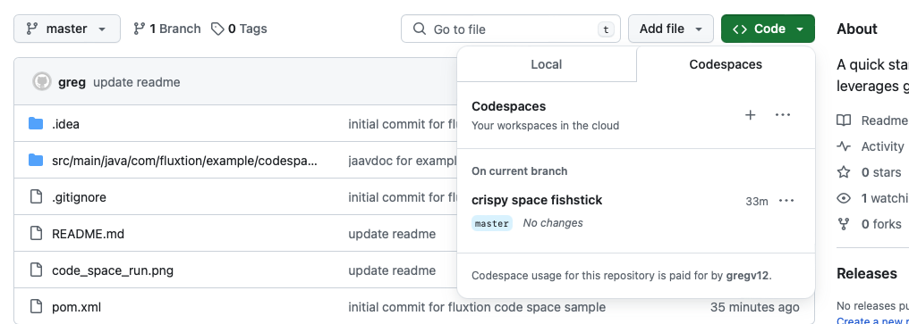
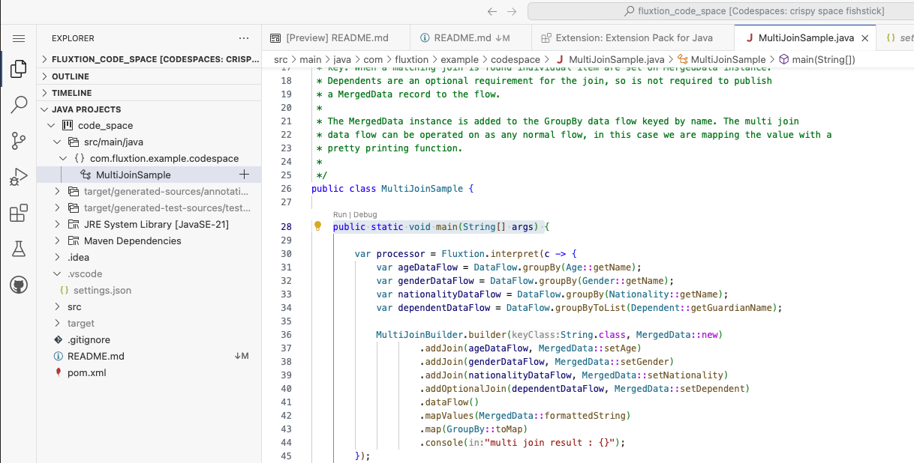
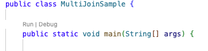
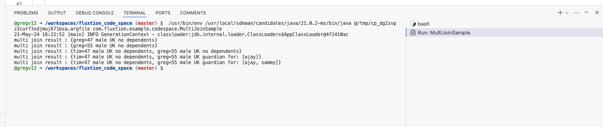

# Fluxtion code space example

This is a quick start Fluxtion example to get you up and running in github code spaces without needing to locally clone,
build and run the repository.

Steps to use:

* select open in code space
* select java project on left hand menu
* choose MultiJoinSample.java and open
* hit the run badge above the public static void main(String[] args) method

## Open in code space

  

## Code space java project view

  

## Hit run badge

## Execution output

# to stop a code space

https://github.com/codespaces

**I need a guinea pig to try this out!!!**